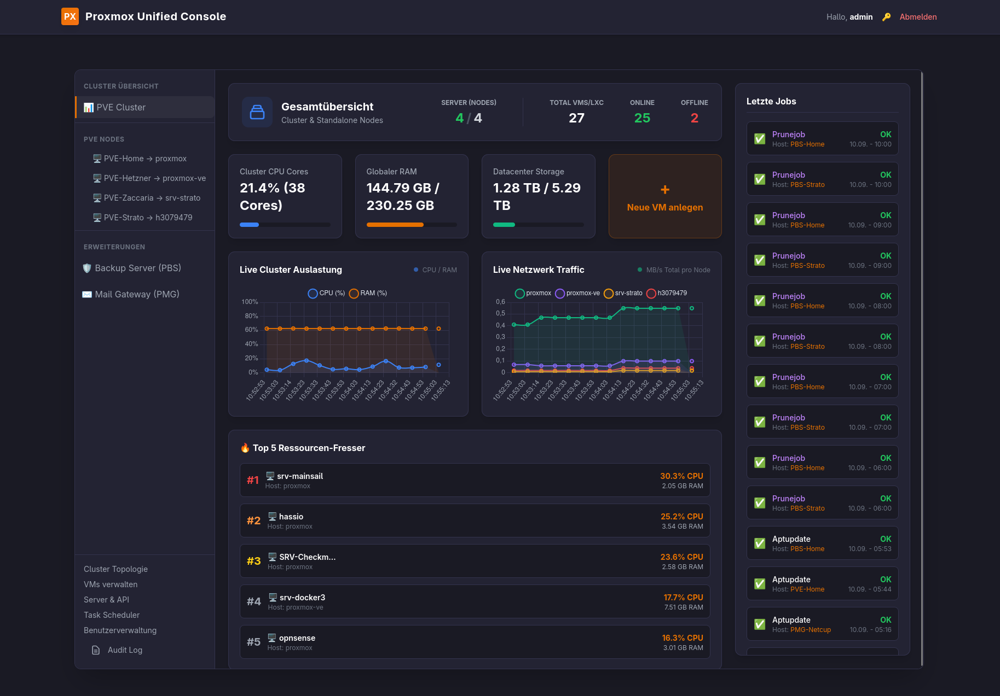

# Proxmox Unified Console (PUC) 🚀

A lightning-fast, unified web dashboard to manage your **Proxmox Virtual Environment (PVE)**, **Proxmox Backup Server (PBS)**, and **Proxmox Mail Gateway (PMG)** from a single, clean interface. 

Built entirely with native APIs—no slow iframes, no CORS issues.

---

## ✨ Features

### 💻 Proxmox VE (PVE)
* **Live Metrics:** Real-time CPU, RAM, and Network monitoring using Chart.js.
* **VM / LXC Lifecycle Management:** Start, Stop, Reboot, Delete, and Create Virtual Machines and LXC containers directly from the dashboard.
* **Smart NoVNC-Console:** Seamlessly integrated popout console to bypass Iframe-CORS restrictions.
* **Hardware & Network Config:** Add Network Interfaces (NICs) and expand Virtual Disks on the fly.
* **Backup & Snapshots:** Take snapshots, roll back to previous states, and trigger manual vzdump backups.

### 💾 Proxmox Backup Server (PBS)
* **Live Datastore Monitoring:** Keep track of your storage capacity across all PBS nodes.
* **Snapshot Explorer:** Browse through your backups with full namespace support.
* **System Jobs Overview:** Monitor Garbage Collection, Prune, and Verify tasks.
* **Sync Jobs:** Quick overview of all configured synchronization tasks.
* **Task Log Viewer:** Read PBS task logs directly in your browser.

### 📧 Proxmox Mail Gateway (PMG)
* **Spam Quarantine:** View, delete, or deliver quarantined emails across all your PMG instances.
* **Mail Queue Tracking:** Inspect Active, Deferred, and Hold Postfix queues.
* **Tracking Center:** Advanced Syslog parser to track email delivery statuses.
* **Configuration Editor:** Manage Default Relays, External/Internal Ports, TLS settings, Trusted Networks, and Relay Domains.
* **SSL Management:** View expiring certificates and deploy new PEM/KEY pairs with a single click.

### ⚙️ System & Security
* **Unified Multi-Node Management:** Connect unlimited PVE, PBS, and PMG instances via API tokens.
* **Granular User Roles:** Admin, VM-Manager, and Viewer roles. Restrict specific VMs to specific users.
* **Task Scheduler:** Built-in cron system to automate operations (e.g., node or VM reboots at night).
* **Audit Log:** Comprehensive tracking of all user actions (creation, deletion, configuration changes).
* **Secure by Default:** Auto-generated Self-Signed SSL out of the box (Port 443).

---

## 📦 Quickstart (Docker & Portainer)

The easiest way to install PUC is via Docker Compose. The application comes with its own Apache web server and automatically generates a self-signed SSL certificate for HTTPS access.

**1. Create a `docker-compose.yml`:**

version: '3.8'

services:
  pve-dashboard:
    image: stessmann/proxmox-unified-console:latest
    container_name: puc_dashboard
    restart: unless-stopped
    ports:
      - "8080:80"
      - "8443:443" 
    volumes:
      - ./data:/var/www/data
    environment:
      - TZ=Europe/Berlin

**2. Start the container:**

docker compose up -d

**3. ⚠️ IMPORTANT: Fix SQLite Permissions:**
Since the container runs as the `www-data` user (UID 33) for security reasons, and the newly created `./data` volume folder is usually owned by `root` on the host, you need to grant write permissions. Run this in the directory of your compose file:

sudo chown -R 33:33 ./data
sudo chmod -R 775 ./data

**4. Login:**
Open `https://<YOUR-IP>:8443` in your browser (ignore the self-signed certificate warning).

* **Username:** `admin`
* **Password:** `admin` *(Please change this immediately after logging in by clicking the 🔑 icon in the top right corner!)*

---

## 🛠️ Architecture

* **Backend:** PHP 8.2 with a custom, modular API Router (`api_pve.php`, `api_pbs.php`, `api_pmg.php`).
* **Database:** SQLite (Stored securely in the mapped `./data` volume).
* **Frontend:** Vanilla JavaScript + Tailwind CSS (Zero heavy build steps required).
* **Environment:** Fully containerized via Docker and docker-compose.

---

## 🤝 Contributing

Pull requests are welcome. For major changes, please open an issue first to discuss what you would like to change.

## 📄 License

MIT